# 🌳 Ape 3 - Arboles

**Asignatura:** Estructura de Datos  
**Nivel:** Tercero B 
**Docente:** Ing. Jose Caiza, Mg.  
**Autores:** Alexis Nata

---

## 📋 Descripción

Este repositorio contiene la resolución de la Guía Práctica #3 sobre **Árboles**, implementada en **C++** y **Java**. El objetivo es aplicar los conceptos teóricos vistos en clase mediante la implementación de algoritmos sobre árboles N-arios, árboles binarios y Árboles Binarios de Búsqueda (BST).

---

## 🎯 Objetivos de Aprendizaje

Al completar estos ejercicios, serás capaz de:

1. Comprender y manipular la estructura básica de nodos con múltiples hijos (N-arios) y nodos binarios.
2. Implementar la lógica de inserción en un Árbol Binario de Búsqueda (BST).
3. Utilizar la recursividad para calcular métricas estructurales como la profundidad máxima.
4. Extraer datos mediante recorridos estándar (In-Order).
5. Modificar la estructura subyacente de los punteros para transformar un árbol (árbol espejo).

---

## 📁 Estructura del Repositorio

```
APEN3-Arboles/
│
├── Ejercicio1/
│   ├── cpp/        # Conteo de nodos en árboles N-arios (C++)
│   └── java/       # Conteo de nodos en árboles N-arios (Java)
│
├── Ejercicio2/
│   ├── cpp/        # Inserción en BST (C++)
│   └── java/       # Inserción en BST (Java)
│
├── Ejercicio3/
│   ├── cpp/        # Cálculo de profundidad máxima (C++)
│   └── java/       # Cálculo de profundidad máxima (Java)
│
├── Ejercicio4/
│   ├── cpp/        # Recorrido In-Order (C++)
│   └── java/       # Recorrido In-Order (Java)
│
└── Ejercicio5/
    ├── cpp/        # Inversión / Árbol espejo (C++)
    └── java/       # Inversión / Árbol espejo (Java)
```

---

## 📝 Ejercicios

---

### Ejercicio 1 — Conteo de nodos en árboles N-arios

Se implementó una función recursiva para contar la cantidad total de nodos en un árbol N-ario. El algoritmo recorre cada nodo y suma 1 por el nodo actual más el total de nodos de cada uno de sus hijos.

**Lógica implementada:**
- Si la raíz es `NULL`, el árbol está vacío y retorna `0`.
- Se inicia el total en `1` (se cuenta el nodo raíz).
- Se recorre la lista de hijos y se llama recursivamente a `contarNodos()`, sumando al total.
- Finalmente retorna el total de nodos.

**C++**

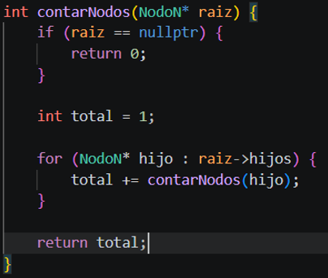

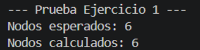

**Java**

> La lógica es idéntica a C++; cambia únicamente la sintaxis: se usa `null` en lugar de `NULL`, se reemplaza `->` por `.` y no se utilizan punteros.

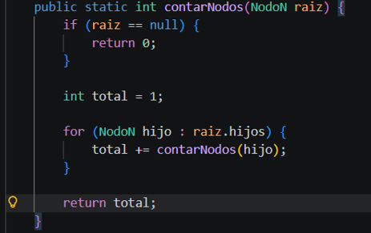

---

### Ejercicio 2 — Inserción en Árbol Binario de Búsqueda (BST)

Se implementó la lógica de inserción en un BST utilizando recursividad. El algoritmo compara el valor a insertar con el nodo actual:
- Si el valor es **menor**, se inserta en el subárbol **izquierdo**.
- Si el valor es **mayor**, se inserta en el subárbol **derecho**.
- Si el árbol está vacío (`nullptr`), se crea un nuevo nodo con ese valor.

**C++**

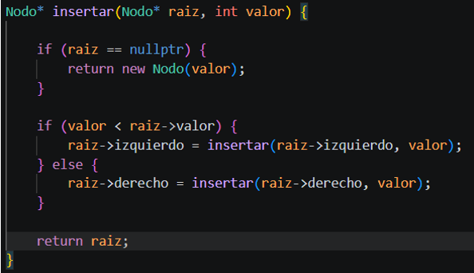

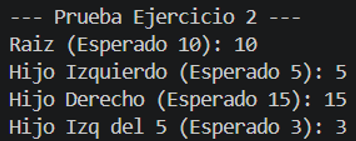

**Java**

> Misma lógica que C++. Se usa `null` en lugar de `nullptr` y se accede a los atributos con `.` en lugar de `->`.

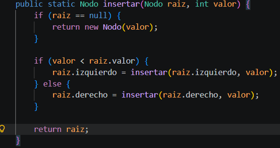

---

### Ejercicio 3 — Cálculo de profundidad máxima

Se implementó una función recursiva para calcular la altura máxima de un árbol binario. La altura es el número máximo de niveles desde la raíz hasta la hoja más profunda.

**Lógica implementada:**
- Si el nodo está vacío, la altura es `0` (caso base).
- Se calcula recursivamente la altura del subárbol izquierdo y derecho.
- Se retorna el máximo de ambas alturas más `1` (el nodo actual).

**C++**

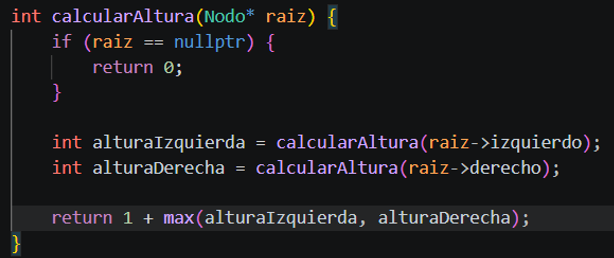

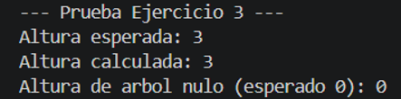

**Java**

> Se declara como método estático con `public static`. No se usan punteros; se accede a los nodos con `.`.

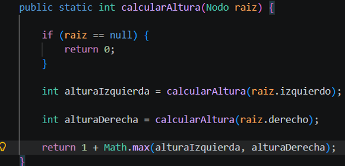

---

### Ejercicio 4 — Recorrido In-Order

Se implementó el recorrido In-Order en un árbol binario utilizando recursividad. El orden de visita es:

1. Subárbol **izquierdo**
2. **Nodo actual**
3. Subárbol **derecho**

Este recorrido produce los valores ordenados de menor a mayor cuando se aplica sobre un BST.

**Lógica implementada:**
- Si el nodo es `NULL`, se retorna inmediatamente (caso base).
- Se recorre recursivamente el subárbol izquierdo.
- Se guarda el valor del nodo actual en el vector resultado.
- Se recorre recursivamente el subárbol derecho.

**C++**

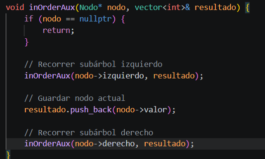

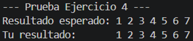

**Java**

> Se implementa como método estático `inOrderAux` que recibe un nodo y una lista. La lógica de recorrido es idéntica.

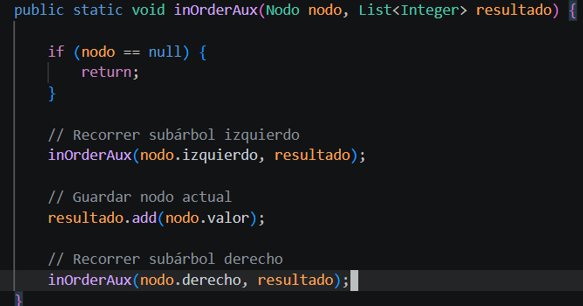

---

### Ejercicio 5 — Inversión / Árbol espejo

Se implementó la inversión de un árbol binario (árbol espejo). El algoritmo intercambia los hijos izquierdo y derecho de cada nodo de forma recursiva, reflejando toda la estructura del árbol.

**Lógica implementada:**
- Si la raíz es `NULL`, no hay nada que invertir y se retorna.
- Se guarda el hijo izquierdo en una variable temporal `temp`.
- Se asigna el hijo derecho al izquierdo.
- Se asigna `temp` al derecho.
- Se llama recursivamente para invertir ambos subárboles.

**C++**

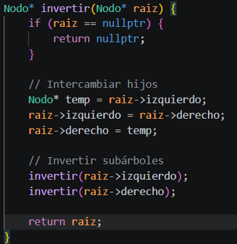

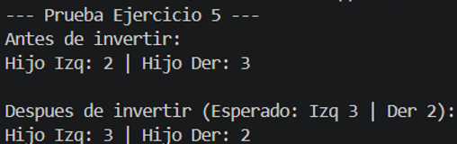

**Java**

> Misma lógica. Se usa una variable temporal para el intercambio y se llama recursivamente sobre ambos hijos.

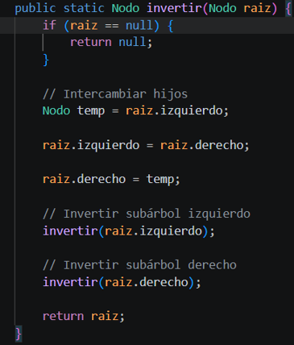

---

## 🚀 Ejecución

### C++
```bash
g++ -o programa archivo.cpp
./programa
```

### Java
```bash
javac Archivo.java
java Archivo
```

---

## 🧠 Conceptos Clave

- **Árbol N-ario:** Estructura recursiva donde cada nodo puede tener cualquier número de hijos.
- **Árbol Binario:** Cada nodo tiene como máximo dos hijos (izquierdo y derecho).
- **BST (Binary Search Tree):** Árbol binario donde los valores menores van a la izquierda y los mayores a la derecha.
- **Recorrido In-Order:** Visita los nodos en orden izquierda → raíz → derecha. En un BST produce los valores de menor a mayor.
- **Árbol Espejo:** Resultado de invertir recursivamente todos los hijos izquierdo y derecho de un árbol binario.

---

## 📚 Referencias

- [Árboles N-arios — Blog Estructuras de Datos](https://miblogestructurasdedatos.blogspot.com/p/arboles-n-arios-un-arbol-n-ario-es-una.html)
- [DSA Binary Trees — W3Schools](https://www.w3schools.com/dsa/dsa_data_binarytrees.php)
- [DSA Binary Search Trees — W3Schools](https://www.w3schools.com/dsa/dsa_data_binarysearchtrees.php)